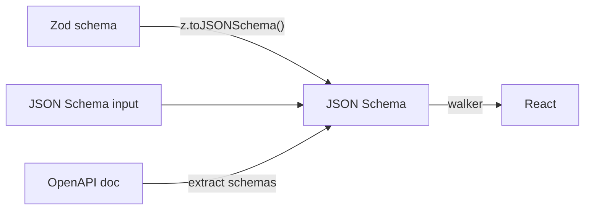

# schema-components

[](https://github.com/Mearman/schema-components)
[](https://www.npmjs.com/package/schema-components)
[](https://opensource.org/licenses/MIT)
[](https://github.com/Mearman/schema-components/actions)
[](https://mearman.github.io/schema-components/)
[](https://mearman.github.io/schema-components/storybook/)

React components that render UI from Zod schemas, JSON Schema, and OpenAPI documents.

Define your data model once. Get presentational views, input fields, and editable forms — no manual wiring.

## Install

```bash
npm install schema-components
```

Peer dependencies: `zod@^4.0.0`, `react@^18.0.0 || ^19.0.0`.

### Zod version requirement

schema-components requires **Zod 4**. If you are on Zod 3, see the [Zod 4 migration guide](https://zod.dev/v4/migration). If a Zod 3 schema is passed (detected via `_def.typeName`), a descriptive `SchemaNormalisationError` is raised pointing at the Zod 4 migration guide. Schemas from other Standard Schema libraries are not currently supported.

## Quick start

```tsx
import { z } from "zod";
import { SchemaComponent } from "schema-components/react/SchemaComponent";

const userSchema = z.object({
  name: z.string().min(1).meta({ description: "Full name" }),
  email: z.email().meta({ description: "Email address" }),
  role: z.enum(["admin", "editor", "viewer"]).meta({ description: "Role" }),
  active: z.boolean().meta({ description: "Active" }),
});

function UserCard() {
  const [user, setUser] = useState({
    name: "Ada Lovelace",
    email: "ada@example.com",
    role: "admin",
    active: true,
  });

  return (
    <SchemaComponent
      schema={userSchema}
      value={user}
      onChange={setUser}
    />
  );
}
```

Renders every field as an editable input. Add `readOnly` to the component for a read-only view:

```tsx
<SchemaComponent schema={userSchema} value={user} readOnly />
```

## How it works



One walker, one input format. The walker reads standard JSON Schema keywords (Draft 2020-12) — decoupled from Zod's internal API. `z.toJSONSchema()` is lossless: it preserves `readOnly`, `writeOnly`, custom `.meta()` properties, constraints, formats, and defaults.

`z.fromJSONSchema()` is used **only for validation** — converting JSON Schema / OpenAPI inputs back to Zod when `validate` is true and the original wasn't a Zod schema.

## Spec support

| Spec | Support |
|---|---|
| JSON Schema Draft 04 / 06 / 07 / 2019-09 / 2020-12 | All supported; older drafts normalised to Draft 2020-12 |
| OpenAPI 2.0 (Swagger) | Full document restructure to OpenAPI 3.1 |
| OpenAPI 3.0.x | `nullable`, `discriminator`, `example` normalised |
| OpenAPI 3.1.x | Native; webhooks and `components/pathItems` resolved |

See [packages/core/README.md](packages/core/README.md#spec-support) for the full keyword matrix and documented type-level fallbacks.

## Examples

### All input formats

`<SchemaComponent>` auto-detects the input format:

```tsx
// Zod schema
<SchemaComponent schema={z.object({ name: z.string() })} value={data} />

// JSON Schema
<SchemaComponent
  schema={{ type: "object", properties: { name: { type: "string" } } }}
  value={data}
/>

// OpenAPI document + ref
<SchemaComponent
  schema={openApiSpec}
  ref="#/components/schemas/User"
  value={data}
/>
```

### OpenAPI operations

Render API operations with type-safe field overrides:

```tsx
import { ApiOperation } from "schema-components/openapi/components";

// Full operation — parameters, request body, responses
<ApiOperation schema={petStore} path="/pets" method="post" />

// Just the request body with type-safe fields
<ApiRequestBody
  schema={petStore}
  path="/pets"
  method="post"
  fields={{
    name: { description: "Pet name" },    // ✓ inferred from as const
  }}
/>
```

### Theme adapters

Headless by default (plain HTML). Wrap with a theme adapter for styled components:

```tsx
import { SchemaProvider } from "schema-components/react/SchemaComponent";
import { shadcnResolver } from "schema-components/themes/shadcn";

<SchemaProvider resolver={shadcnResolver}>
  <SchemaComponent schema={userSchema} value={user} onChange={setUser} />
</SchemaProvider>
```

### Raw HTML (no React)

```tsx
import { renderToHtml } from "schema-components/html/renderToHtml";

const html = renderToHtml(userSchema, {
  value: { name: "Ada Lovelace", email: "ada@example.com", role: "admin" },
  readOnly: true,
});
```

### Server Components

```tsx
import { SchemaView } from "schema-components/react/SchemaView";

export default async function Page() {
  const user = await getUser();
  return <SchemaView schema={userSchema} value={user} />;
}
```

## Architecture

Every module is imported directly — no barrel files. Organised exports:

```
schema-components/core/*         # Walker, types, guards, errors, resolver
schema-components/react/*        # SchemaComponent, SchemaView, SchemaErrorBoundary, headless
schema-components/openapi/*      # Parser, ApiOperation, ApiParameters, etc.
schema-components/html/*         # renderToHtml, renderToHtmlChunks, h() builder, styles
schema-components/themes/*       # shadcn, MUI, custom adapters
schema-components/styles.css     # Default stylesheet for HTML output
```

## API inventory

Every public export, auto-generated from JSDoc. Click a name for full signature, parameters, and examples on the [TypeDoc site](https://mearman.github.io/schema-components/).

<!-- @generated:api-inventory:start -->
<details>
<summary><code>core/*</code> — 218 exports</summary>

| Symbol | Sub-path | Kind | Summary | Stories |
| --- | --- | --- | --- | --- |
| [`__CLASSIFIER_RULES_FOR_TEST`](https://mearman.github.io/schema-components/variables/core_adapter.__CLASSIFIER_RULES_FOR_TEST.html) | `core/adapter` | Variable | Exposed for unit testing — lets the contract test enumerate every rule's `prefix` value and assert mutual non-prefixing. |  |
| [`detectSchemaKind`](https://mearman.github.io/schema-components/functions/core_adapter.detectSchemaKind.html) | `core/adapter` | Function | Classify a runtime schema input by structural markers — Zod 4, Zod 3, OpenAPI document, plain JSON Schema, or an unsupported third-party schema library. |  |
| [`extractRootMetaFromJson`](https://mearman.github.io/schema-components/functions/core_adapter.extractRootMetaFromJson.html) | `core/adapter` | Function | Surface root-level metadata from the JSON Schema into the `rootMeta` shape consumed by the walker. |  |
| [`isCodecSchema`](https://mearman.github.io/schema-components/functions/core_adapter.isCodecSchema.html) | `core/adapter` | Function | True when `value` is a Zod schema implemented as a codec (`z.codec(...)`). |  |
| `JsonObject` | `core/adapter` | Re-export | _undocumented_ |  |
| [`NormalisedSchema`](https://mearman.github.io/schema-components/interfaces/core_adapter.NormalisedSchema.html) | `core/adapter` | Interface | Result of normaliseSchema. |  |
| [`NormaliseOptions`](https://mearman.github.io/schema-components/interfaces/core_adapter.NormaliseOptions.html) | `core/adapter` | Interface | Options accepted by normaliseSchema. |  |
| [`normaliseSchema`](https://mearman.github.io/schema-components/functions/core_adapter.normaliseSchema.html) | `core/adapter` | Function | Normalise any supported schema input — Zod 4 schema, plain JSON Schema (any draft), Swagger 2.0, OpenAPI 3.0 or 3.1 document — into a canonical Draft 2020-12 NormalisedSchema the walker can consume. |  |
| [`SchemaInput`](https://mearman.github.io/schema-components/types/core_adapter.SchemaInput.html) | `core/adapter` | Type | Permissive input alias accepted by normaliseSchema. |  |
| [`SchemaIoSide`](https://mearman.github.io/schema-components/types/core_adapter.SchemaIoSide.html) | `core/adapter` | Type | Direction of the Zod transform / pipe / codec that normaliseSchema should surface to the renderer. |  |
| [`SchemaKind`](https://mearman.github.io/schema-components/types/core_adapter.SchemaKind.html) | `core/adapter` | Type | Classification produced by detectSchemaKind when inspecting a runtime schema input. |  |
| `SchemaMeta` | `core/adapter` | Re-export | _undocumented_ |  |
| [`extractArrayConstraints`](https://mearman.github.io/schema-components/functions/core_constraints.extractArrayConstraints.html) | `core/constraints` | Function | _undocumented_ |  |
| [`extractFileConstraints`](https://mearman.github.io/schema-components/functions/core_constraints.extractFileConstraints.html) | `core/constraints` | Function | _undocumented_ |  |
| [`extractNumberConstraints`](https://mearman.github.io/schema-components/functions/core_constraints.extractNumberConstraints.html) | `core/constraints` | Function | _undocumented_ |  |
| [`extractObjectConstraints`](https://mearman.github.io/schema-components/functions/core_constraints.extractObjectConstraints.html) | `core/constraints` | Function | _undocumented_ |  |
| [`extractStringConstraints`](https://mearman.github.io/schema-components/functions/core_constraints.extractStringConstraints.html) | `core/constraints` | Function | _undocumented_ |  |
| [`stripInapplicableConstraints`](https://mearman.github.io/schema-components/functions/core_constraints.stripInapplicableConstraints.html) | `core/constraints` | Function | Return a copy of the schema with constraint keywords that don't apply to the given type removed. |  |
| [`ELLIPSIS`](https://mearman.github.io/schema-components/variables/core_cssClasses.ELLIPSIS.html) | `core/cssClasses` | Variable | Single-character ellipsis used in placeholders like "Select…". |  |
| [`EM_DASH`](https://mearman.github.io/schema-components/variables/core_cssClasses.EM_DASH.html) | `core/cssClasses` | Variable | Common em-dash placeholder for empty / unset values. |  |
| [`SC_CLASSES`](https://mearman.github.io/schema-components/variables/core_cssClasses.SC_CLASSES.html) | `core/cssClasses` | Variable | Canonical CSS class names exposed by the default render pipelines. |  |
| [`SC_ID_PREFIX`](https://mearman.github.io/schema-components/variables/core_cssClasses.SC_ID_PREFIX.html) | `core/cssClasses` | Variable | Prefix applied to every generated DOM id by `buildInputId`. |  |
| [`ScClassKey`](https://mearman.github.io/schema-components/types/core_cssClasses.ScClassKey.html) | `core/cssClasses` | Type | _undocumented_ |  |
| [`appendPointer`](https://mearman.github.io/schema-components/functions/core_diagnostics.appendPointer.html) | `core/diagnostics` | Function | Append a segment to a JSON Pointer. |  |
| [`Diagnostic`](https://mearman.github.io/schema-components/interfaces/core_diagnostics.Diagnostic.html) | `core/diagnostics` | Interface | A single diagnostic emitted during schema processing. |  |
| [`DiagnosticCode`](https://mearman.github.io/schema-components/types/core_diagnostics.DiagnosticCode.html) | `core/diagnostics` | Type | Machine-readable codes identifying each class of diagnostic. |  |
| [`DiagnosticSink`](https://mearman.github.io/schema-components/types/core_diagnostics.DiagnosticSink.html) | `core/diagnostics` | Type | Callback that receives each diagnostic as it is emitted. |  |
| [`DiagnosticsOptions`](https://mearman.github.io/schema-components/interfaces/core_diagnostics.DiagnosticsOptions.html) | `core/diagnostics` | Interface | Diagnostics configuration threaded through the processing pipeline. |  |
| [`emitDiagnostic`](https://mearman.github.io/schema-components/functions/core_diagnostics.emitDiagnostic.html) | `core/diagnostics` | Function | Emit a diagnostic through the configured sink. |  |
| [`SchemaError`](https://mearman.github.io/schema-components/classes/core_errors.SchemaError.html) | `core/errors` | Class | Base class for every schema-components error. | [Validation/Errors](https://mearman.github.io/schema-components/storybook/?path=/docs/validation-errors--docs) |
| [`SchemaFieldError`](https://mearman.github.io/schema-components/classes/core_errors.SchemaFieldError.html) | `core/errors` | Class | A field path could not be resolved against the walked schema tree. | [Validation/Errors](https://mearman.github.io/schema-components/storybook/?path=/docs/validation-errors--docs) |
| [`SchemaNormalisationError`](https://mearman.github.io/schema-components/classes/core_errors.SchemaNormalisationError.html) | `core/errors` | Class | The adapter failed to convert the input schema to JSON Schema. | [Validation/Errors](https://mearman.github.io/schema-components/storybook/?path=/docs/validation-errors--docs) |
| [`SchemaRenderError`](https://mearman.github.io/schema-components/classes/core_errors.SchemaRenderError.html) | `core/errors` | Class | A theme adapter's render function threw during rendering. | [Validation/Errors](https://mearman.github.io/schema-components/storybook/?path=/docs/validation-errors--docs) |
| [`sortFieldsByOrder`](https://mearman.github.io/schema-components/functions/core_fieldOrder.sortFieldsByOrder.html) | `core/fieldOrder` | Function | Sort `Object.entries(fields)` by `meta.order`. |  |
| [`dateInputType`](https://mearman.github.io/schema-components/functions/core_formats.dateInputType.html) | `core/formats` | Function | Map a JSON Schema string `format` to the matching HTML `<input type="…">` value, or `undefined` when the format does not correspond to a date/time input. |  |
| [`EMAIL_FORMAT_PATTERN`](https://mearman.github.io/schema-components/variables/core_formats.EMAIL_FORMAT_PATTERN.html) | `core/formats` | Variable | Email format pattern, exported as a named const so callers that need a guaranteed `RegExp` (rather than the `RegExp \| undefined` shape of `FORMAT_PATTERNS[name]` under `noUncheckedIndexedAccess`) can import it directly. |  |
| [`FORMAT_PATTERNS`](https://mearman.github.io/schema-components/variables/core_formats.FORMAT_PATTERNS.html) | `core/formats` | Variable | _undocumented_ |  |
| [`FormatValidator`](https://mearman.github.io/schema-components/types/core_formats.FormatValidator.html) | `core/formats` | Type | A format validator: either a RegExp pattern or a predicate function. |  |
| [`MAX_REGEX_PATTERN_LENGTH`](https://mearman.github.io/schema-components/variables/core_formats.MAX_REGEX_PATTERN_LENGTH.html) | `core/formats` | Variable | Maximum length of a string that will be compiled by `new RegExp(...)`. |  |
| [`validateFormat`](https://mearman.github.io/schema-components/functions/core_formats.validateFormat.html) | `core/formats` | Function | Validate a string value against format constraints. |  |
| [`getProperty`](https://mearman.github.io/schema-components/functions/core_guards.getProperty.html) | `core/guards` | Function | Safe property access on unknown values. |  |
| [`hasProperty`](https://mearman.github.io/schema-components/functions/core_guards.hasProperty.html) | `core/guards` | Function | Check if a value is an object with a specific own-property. |  |
| [`isObject`](https://mearman.github.io/schema-components/functions/core_guards.isObject.html) | `core/guards` | Function | Narrows `unknown` to a non-null, non-array object. |  |
| [`toRecord`](https://mearman.github.io/schema-components/functions/core_guards.toRecord.html) | `core/guards` | Function | Convert a known `object` to `Record<string, unknown>` by iterating `Object.entries`. |  |
| [`toRecordOrUndefined`](https://mearman.github.io/schema-components/functions/core_guards.toRecordOrUndefined.html) | `core/guards` | Function | Convert `unknown` to `Record<string, unknown> \| undefined`. |  |
| [`fieldDomId`](https://mearman.github.io/schema-components/functions/core_idPath.fieldDomId.html) | `core/idPath` | Function | Build the canonical `sc-`-prefixed DOM id for a structural path. |  |
| [`hintIdFor`](https://mearman.github.io/schema-components/functions/core_idPath.hintIdFor.html) | `core/idPath` | Function | Derive the constraint-hint element id for a given field id. |  |
| [`normaliseIdSegment`](https://mearman.github.io/schema-components/functions/core_idPath.normaliseIdSegment.html) | `core/idPath` | Function | Normalise a structural path into the id segment used after the `sc-` prefix. |  |
| [`panelIdFor`](https://mearman.github.io/schema-components/functions/core_idPath.panelIdFor.html) | `core/idPath` | Function | Derive the tab panel id for a discriminated-union container at `path`. |  |
| [`tabIdFor`](https://mearman.github.io/schema-components/functions/core_idPath.tabIdFor.html) | `core/idPath` | Function | Derive the id for tab `i` within a discriminated-union container at `path`. |  |
| [`MAX_PATH_ITEM_REF_HOPS`](https://mearman.github.io/schema-components/variables/core_limits.MAX_PATH_ITEM_REF_HOPS.html) | `core/limits` | Variable | Maximum number of `$ref` hops permitted when walking a chain of OpenAPI Path Item Object references. |  |
| [`MAX_REF_DEPTH`](https://mearman.github.io/schema-components/variables/core_limits.MAX_REF_DEPTH.html) | `core/limits` | Variable | _undocumented_ |  |
| [`MAX_RENDER_DEPTH`](https://mearman.github.io/schema-components/variables/core_limits.MAX_RENDER_DEPTH.html) | `core/limits` | Variable | Maximum recursion depth for the schema walker, the React renderers, the streaming HTML renderer, and the server-side renderer. |  |
| [`MaxRefDepth`](https://mearman.github.io/schema-components/types/core_limits.MaxRefDepth.html) | `core/limits` | Type | Maximum depth for `$ref` resolution and Zod-tree walks. |  |
| [`ANNOTATION_SIBLINGS`](https://mearman.github.io/schema-components/variables/core_merge.ANNOTATION_SIBLINGS.html) | `core/merge` | Variable | Annotation keywords that can appear as siblings of `$ref` per Draft 2020-12 / OpenAPI 3.1. |  |
| [`detectDiscriminated`](https://mearman.github.io/schema-components/functions/core_merge.detectDiscriminated.html) | `core/merge` | Function | Detect oneOf where every option is an object with a property that has a `const` value → discriminated union. |  |
| [`Discriminated`](https://mearman.github.io/schema-components/interfaces/core_merge.Discriminated.html) | `core/merge` | Interface | _undocumented_ |  |
| [`mergeAllOf`](https://mearman.github.io/schema-components/functions/core_merge.mergeAllOf.html) | `core/merge` | Function | Merge multiple JSON Schema objects from allOf into one. |  |
| [`mergeRefSiblings`](https://mearman.github.io/schema-components/functions/core_merge.mergeRefSiblings.html) | `core/merge` | Function | Merge annotation siblings from the referencing node onto the resolved target's annotations. |  |
| [`normaliseAnyOf`](https://mearman.github.io/schema-components/functions/core_merge.normaliseAnyOf.html) | `core/merge` | Function | Detect `anyOf: [T, { type: "null" }]` → nullable T. |  |
| [`NormalisedAnyOf`](https://mearman.github.io/schema-components/interfaces/core_merge.NormalisedAnyOf.html) | `core/merge` | Interface | _undocumented_ |  |
| [`deepNormalise`](https://mearman.github.io/schema-components/functions/core_normalise.deepNormalise.html) | `core/normalise` | Function | Deep-normalise a JSON Schema object by applying a per-node transform and recursing into every sub-schema location. |  |
| [`deepNormaliseWithContext`](https://mearman.github.io/schema-components/functions/core_normalise.deepNormaliseWithContext.html) | `core/normalise` | Function | Deep-normalise a JSON Schema object, threading a context (diagnostics sink + JSON Pointer) through each recursive call. |  |
| [`documentContainsKeyword`](https://mearman.github.io/schema-components/functions/core_normalise.documentContainsKeyword.html) | `core/normalise` | Function | Scan a JSON document body for the presence of a named keyword anywhere in the structure. |  |
| [`NodeContext`](https://mearman.github.io/schema-components/interfaces/core_normalise.NodeContext.html) | `core/normalise` | Interface | Per-node context threaded through `deepNormaliseWithContext`. |  |
| [`NodeTransform`](https://mearman.github.io/schema-components/types/core_normalise.NodeTransform.html) | `core/normalise` | Type | Per-node transform applied by deepNormalise when no diagnostics context needs to be threaded — see NodeTransformWithContext for the variant used by the JSON Schema normalisation path. |  |
| [`NodeTransformWithContext`](https://mearman.github.io/schema-components/types/core_normalise.NodeTransformWithContext.html) | `core/normalise` | Type | Per-node transform applied by deepNormaliseWithContext. |  |
| [`normaliseDraft04Node`](https://mearman.github.io/schema-components/functions/core_normalise.normaliseDraft04Node.html) | `core/normalise` | Function | Normalise Draft 04 `exclusiveMinimum`/`exclusiveMaximum` from boolean to number form, plus the other Draft 04 translations applied to a single node. |  |
| [`normaliseJsonSchema`](https://mearman.github.io/schema-components/functions/core_normalise.normaliseJsonSchema.html) | `core/normalise` | Function | Normalise a JSON Schema to canonical Draft 2020-12 form. |  |
| [`normaliseOpenApiSchemas`](https://mearman.github.io/schema-components/functions/core_normalise.normaliseOpenApiSchemas.html) | `core/normalise` | Function | Normalise an OpenAPI document's schemas for walker consumption. |  |
| [`selectDraftTransform`](https://mearman.github.io/schema-components/functions/core_normalise.selectDraftTransform.html) | `core/normalise` | Function | Pick the per-node transform that normalises a single Schema Object to canonical Draft 2020-12 form for the supplied draft. |  |
| [`applyDiscriminatorAllOfPrepass`](https://mearman.github.io/schema-components/functions/core_openapi30.applyDiscriminatorAllOfPrepass.html) | `core/openapi30` | Function | Document-level pre-pass for OpenAPI discriminators that are declared on a base schema and inherited by subtypes via `allOf`. |  |
| [`deepNormaliseOpenApi30Doc`](https://mearman.github.io/schema-components/functions/core_openapi30.deepNormaliseOpenApi30Doc.html) | `core/openapi30` | Function | Backwards-compatible wrapper retaining the historic `deepNormalise` signature used by callers in `normalise.ts`. |  |
| [`deepNormaliseOpenApiDoc`](https://mearman.github.io/schema-components/functions/core_openapi30.deepNormaliseOpenApiDoc.html) | `core/openapi30` | Function | Deep-normalise every Schema Object in an OpenAPI document. |  |
| [`liftExampleToExamples`](https://mearman.github.io/schema-components/functions/core_openapi30.liftExampleToExamples.html) | `core/openapi30` | Function | Lift OpenAPI 3.x singular `example` onto the plural `examples` key. |  |
| [`normaliseOpenApi30Combined`](https://mearman.github.io/schema-components/functions/core_openapi30.normaliseOpenApi30Combined.html) | `core/openapi30` | Function | Combined OpenAPI 3.0.x node transform: Draft 04 + nullable + discriminator. |  |
| [`normaliseOpenApi30Discriminator`](https://mearman.github.io/schema-components/functions/core_openapi30.normaliseOpenApi30Discriminator.html) | `core/openapi30` | Function | Normalise OpenAPI 3.0.x `discriminator` keyword by injecting `const` values into each `oneOf`/`anyOf` option's discriminator property. |  |
| [`normaliseOpenApi30Node`](https://mearman.github.io/schema-components/functions/core_openapi30.normaliseOpenApi30Node.html) | `core/openapi30` | Function | Normalise OpenAPI 3.0.x `nullable` keyword to `anyOf [T, null]`. |  |
| [`DEFAULT_OPENAPI_CONTENT_TYPE`](https://mearman.github.io/schema-components/variables/core_openapiConstants.DEFAULT_OPENAPI_CONTENT_TYPE.html) | `core/openapiConstants` | Variable | Default media type used when an OpenAPI document elides `consumes` / `produces` or a Schema Object stands alone (no parent Media Type). |  |
| [`HTTP_METHODS`](https://mearman.github.io/schema-components/variables/core_openapiConstants.HTTP_METHODS.html) | `core/openapiConstants` | Variable | Canonical OpenAPI 3.x HTTP method tuple in path-item iteration order. |  |
| [`HttpMethod`](https://mearman.github.io/schema-components/types/core_openapiConstants.HttpMethod.html) | `core/openapiConstants` | Type | _undocumented_ |  |
| [`REF_PREFIXES`](https://mearman.github.io/schema-components/variables/core_openapiConstants.REF_PREFIXES.html) | `core/openapiConstants` | Variable | Canonical `$ref` prefix table for the JSON Pointer locations used by OpenAPI 3.x and Swagger 2.0 documents. |  |
| [`REF_REWRITES`](https://mearman.github.io/schema-components/variables/core_openapiConstants.REF_REWRITES.html) | `core/openapiConstants` | Variable | Swagger 2.0 → OpenAPI 3.x `$ref` prefix mapping. |  |
| [`rewriteSwaggerRefPrefix`](https://mearman.github.io/schema-components/functions/core_openapiConstants.rewriteSwaggerRefPrefix.html) | `core/openapiConstants` | Function | Rewrite a Swagger 2.0 ref prefix onto the equivalent OpenAPI 3.x location. |  |
| [`SWAGGER_2_METHODS`](https://mearman.github.io/schema-components/variables/core_openapiConstants.SWAGGER_2_METHODS.html) | `core/openapiConstants` | Variable | Swagger 2.0 omits `trace` — the keyword was introduced in OpenAPI 3.0. |  |
| [`countDistinctRefs`](https://mearman.github.io/schema-components/functions/core_ref.countDistinctRefs.html) | `core/ref` | Function | Count all distinct `$ref` strings reachable from a root document. |  |
| [`dereference`](https://mearman.github.io/schema-components/functions/core_ref.dereference.html) | `core/ref` | Function | Dereference a JSON Pointer fragment (`#/path/to/schema`) or an `$anchor` (`#SomeName`) against a root document. |  |
| [`ExternalResolver`](https://mearman.github.io/schema-components/types/core_ref.ExternalResolver.html) | `core/ref` | Type | Resolver function for external $ref URIs. |  |
| [`findAnchor`](https://mearman.github.io/schema-components/functions/core_ref.findAnchor.html) | `core/ref` | Function | Recursively scan a schema document for a `$anchor` matching the given name. |  |
| [`RECURSIVE_ANCHOR_SENTINEL`](https://mearman.github.io/schema-components/variables/core_ref.RECURSIVE_ANCHOR_SENTINEL.html) | `core/ref` | Variable | The canonical recursive `$anchor` name synthesised by the Draft 2019-09 `$recursiveAnchor: true` rewrite. |  |
| [`RefOptions`](https://mearman.github.io/schema-components/interfaces/core_ref.RefOptions.html) | `core/ref` | Interface | Options for $ref resolution. |  |
| [`resolveRef`](https://mearman.github.io/schema-components/functions/core_ref.resolveRef.html) | `core/ref` | Function | Resolve a `$ref` in a schema against a root document. |  |
| [`DEFAULT_REF_CHAIN_MAX_HOPS`](https://mearman.github.io/schema-components/variables/core_refChain.DEFAULT_REF_CHAIN_MAX_HOPS.html) | `core/refChain` | Variable | Maximum number of `$ref` hops permitted by default. |  |
| [`resolveRefChain`](https://mearman.github.io/schema-components/functions/core_refChain.resolveRefChain.html) | `core/refChain` | Function | Resolve a `$ref` chain starting from `initial`. |  |
| [`ResolveRefChainOptions`](https://mearman.github.io/schema-components/interfaces/core_refChain.ResolveRefChainOptions.html) | `core/refChain` | Interface | Configuration for a single chain resolution. |  |
| [`AllConstraints`](https://mearman.github.io/schema-components/types/core_renderer.AllConstraints.html) | `core/renderer` | Type | Flat intersection of all constraint types. |  |
| [`BaseFieldProps`](https://mearman.github.io/schema-components/interfaces/core_renderer.BaseFieldProps.html) | `core/renderer` | Interface | Properties available on every schema field, regardless of rendering target. |  |
| [`buildRenderProps`](https://mearman.github.io/schema-components/functions/core_renderer.buildRenderProps.html) | `core/renderer` | Function | Build the `RenderProps` object handed to a resolver render function or a widget. |  |
| [`ComponentResolver`](https://mearman.github.io/schema-components/interfaces/core_renderer.ComponentResolver.html) | `core/renderer` | Interface | _undocumented_ |  |
| [`getHtmlRenderFn`](https://mearman.github.io/schema-components/functions/core_renderer.getHtmlRenderFn.html) | `core/renderer` | Function | Look up the render function for a schema type in an HtmlResolver. |  |
| [`getRenderFunction`](https://mearman.github.io/schema-components/functions/core_renderer.getRenderFunction.html) | `core/renderer` | Function | Look up the render function for a schema type in a ComponentResolver. |  |
| [`HtmlRenderFunction`](https://mearman.github.io/schema-components/types/core_renderer.HtmlRenderFunction.html) | `core/renderer` | Type | An HTML render function returns a string. |  |
| [`HtmlRenderProps`](https://mearman.github.io/schema-components/interfaces/core_renderer.HtmlRenderProps.html) | `core/renderer` | Interface | Props for HTML render functions. |  |
| [`HtmlResolver`](https://mearman.github.io/schema-components/interfaces/core_renderer.HtmlResolver.html) | `core/renderer` | Interface | HTML resolver — maps schema types to HTML string renderers. |  |
| [`mergeHtmlResolvers`](https://mearman.github.io/schema-components/functions/core_renderer.mergeHtmlResolvers.html) | `core/renderer` | Function | Merge two HtmlResolvers — user values take priority, fallback fills gaps. |  |
| [`mergeResolvers`](https://mearman.github.io/schema-components/functions/core_renderer.mergeResolvers.html) | `core/renderer` | Function | Merge two ComponentResolvers — user values take priority, fallback fills gaps. |  |
| [`RenderFunction`](https://mearman.github.io/schema-components/types/core_renderer.RenderFunction.html) | `core/renderer` | Type | _undocumented_ |  |
| [`RenderProps`](https://mearman.github.io/schema-components/interfaces/core_renderer.RenderProps.html) | `core/renderer` | Interface | Props for React render functions. |  |
| [`RESOLVER_KEYS`](https://mearman.github.io/schema-components/variables/core_renderer.RESOLVER_KEYS.html) | `core/renderer` | Variable | _undocumented_ |  |
| [`typeToKey`](https://mearman.github.io/schema-components/functions/core_renderer.typeToKey.html) | `core/renderer` | Function | Map a schema type to the resolver key that handles it. |  |
| [`normaliseSwagger2Document`](https://mearman.github.io/schema-components/functions/core_swagger2.normaliseSwagger2Document.html) | `core/swagger2` | Function | Transform a Swagger 2.0 document into an OpenAPI 3.1-compatible structure. |  |
| [`__SchemaInferenceFellBack`](https://mearman.github.io/schema-components/interfaces/core_typeInference.__SchemaInferenceFellBack.html) | `core/typeInference` | Interface | Marker type emitted when OpenAPI $ref resolution hits the type-level recursion depth limit. |  |
| [`DEFAULT_MAX_DEPTH`](https://mearman.github.io/schema-components/types/core_typeInference.DEFAULT_MAX_DEPTH.html) | `core/typeInference` | Type | Type-level recursion bound for $ref resolution. |  |
| [`DEFAULT_OPENAPI_CONTENT_TYPE`](https://mearman.github.io/schema-components/types/core_typeInference.DEFAULT_OPENAPI_CONTENT_TYPE.html) | `core/typeInference` | Type | Default content type preferred when callers do not specify one. |  |
| [`FromJSONSchema`](https://mearman.github.io/schema-components/types/core_typeInference.FromJSONSchema.html) | `core/typeInference` | Type | Maps a JSON Schema structure to a TypeScript type. |  |
| [`FromJSONSchemaMode`](https://mearman.github.io/schema-components/types/core_typeInference.FromJSONSchemaMode.html) | `core/typeInference` | Type | Direction of inference for `FromJSONSchema`. |  |
| [`InferParameterOverrides`](https://mearman.github.io/schema-components/types/core_typeInference.InferParameterOverrides.html) | `core/typeInference` | Type | Infer the overrides prop type for ApiParameters. |  |
| [`InferRequestBodyFields`](https://mearman.github.io/schema-components/types/core_typeInference.InferRequestBodyFields.html) | `core/typeInference` | Type | Infer the fields prop type for ApiRequestBody. |  |
| [`InferResponseFields`](https://mearman.github.io/schema-components/types/core_typeInference.InferResponseFields.html) | `core/typeInference` | Type | Infer the fields prop type for ApiResponse. |  |
| [`IsSwagger2Doc`](https://mearman.github.io/schema-components/types/core_typeInference.IsSwagger2Doc.html) | `core/typeInference` | Type | Detect whether a document is Swagger 2.0 (OpenAPI 2.0). |  |
| [`OpenAPIRequestBodyType`](https://mearman.github.io/schema-components/types/core_typeInference.OpenAPIRequestBodyType.html) | `core/typeInference` | Type | Infer the TypeScript type of an OpenAPI operation's request body. |  |
| [`OpenAPIResponseType`](https://mearman.github.io/schema-components/types/core_typeInference.OpenAPIResponseType.html) | `core/typeInference` | Type | Infer the TypeScript type of an OpenAPI operation's response. |  |
| [`PathOfType`](https://mearman.github.io/schema-components/types/core_typeInference.PathOfType.html) | `core/typeInference` | Type | Extract all valid dot-separated paths from an object type. |  |
| [`RejectUnrepresentableZod`](https://mearman.github.io/schema-components/types/core_typeInference.RejectUnrepresentableZod.html) | `core/typeInference` | Type | Reject Zod 4 inputs whose runtime conversion is known to throw. |  |
| [`ResolveOpenAPIRef`](https://mearman.github.io/schema-components/types/core_typeInference.ResolveOpenAPIRef.html) | `core/typeInference` | Type | Resolves an OpenAPI `ref` string to its JSON Schema, then parses it. |  |
| [`TypeAtPath`](https://mearman.github.io/schema-components/types/core_typeInference.TypeAtPath.html) | `core/typeInference` | Type | Extract the type at a given dot-separated path. |  |
| [`UnrepresentableZodSchemaError`](https://mearman.github.io/schema-components/interfaces/core_typeInference.UnrepresentableZodSchemaError.html) | `core/typeInference` | Interface | Brand returned in place of a rejected Zod input. |  |
| [`UnrepresentableZodType`](https://mearman.github.io/schema-components/types/core_typeInference.UnrepresentableZodType.html) | `core/typeInference` | Type | Zod 4 types that have no useful JSON Schema representation and so cannot meaningfully be rendered by schema-components. |  |
| [`UnsafeFields`](https://mearman.github.io/schema-components/interfaces/core_typeInference.UnsafeFields.html) | `core/typeInference` | Interface | Escape hatch for recursive schemas where type-level inference cannot proceed. |  |
| [`ArrayConstraints`](https://mearman.github.io/schema-components/interfaces/core_types.ArrayConstraints.html) | `core/types` | Interface | Constraints that apply to array schemas. |  |
| [`ArrayField`](https://mearman.github.io/schema-components/interfaces/core_types.ArrayField.html) | `core/types` | Interface | Properties common to every WalkedField variant. |  |
| [`BooleanField`](https://mearman.github.io/schema-components/interfaces/core_types.BooleanField.html) | `core/types` | Interface | Properties common to every WalkedField variant. |  |
| [`ConditionalField`](https://mearman.github.io/schema-components/interfaces/core_types.ConditionalField.html) | `core/types` | Interface | Properties common to every WalkedField variant. |  |
| [`DiscriminatedUnionField`](https://mearman.github.io/schema-components/interfaces/core_types.DiscriminatedUnionField.html) | `core/types` | Interface | Properties common to every WalkedField variant. |  |
| [`Editability`](https://mearman.github.io/schema-components/types/core_types.Editability.html) | `core/types` | Type | _undocumented_ |  |
| [`EnumField`](https://mearman.github.io/schema-components/interfaces/core_types.EnumField.html) | `core/types` | Interface | Properties common to every WalkedField variant. |  |
| [`FieldBase`](https://mearman.github.io/schema-components/interfaces/core_types.FieldBase.html) | `core/types` | Interface | Properties common to every WalkedField variant. |  |
| [`FieldConstraints`](https://mearman.github.io/schema-components/types/core_types.FieldConstraints.html) | `core/types` | Type | Union of all constraint types. |  |
| [`FieldOverride`](https://mearman.github.io/schema-components/types/core_types.FieldOverride.html) | `core/types` | Type | Per-field override. |  |
| [`FieldOverrides`](https://mearman.github.io/schema-components/types/core_types.FieldOverrides.html) | `core/types` | Type | Recursive mapped type that mirrors a schema's shape for per-field overrides. |  |
| [`FileConstraints`](https://mearman.github.io/schema-components/interfaces/core_types.FileConstraints.html) | `core/types` | Interface | Constraints that apply to file schemas. |  |
| [`FileField`](https://mearman.github.io/schema-components/interfaces/core_types.FileField.html) | `core/types` | Interface | Properties common to every WalkedField variant. |  |
| [`isArrayField`](https://mearman.github.io/schema-components/functions/core_types.isArrayField.html) | `core/types` | Function | _undocumented_ |  |
| [`isBooleanField`](https://mearman.github.io/schema-components/functions/core_types.isBooleanField.html) | `core/types` | Function | _undocumented_ |  |
| [`isConditionalField`](https://mearman.github.io/schema-components/functions/core_types.isConditionalField.html) | `core/types` | Function | _undocumented_ |  |
| [`isDiscriminatedUnionField`](https://mearman.github.io/schema-components/functions/core_types.isDiscriminatedUnionField.html) | `core/types` | Function | _undocumented_ |  |
| [`isEnumField`](https://mearman.github.io/schema-components/functions/core_types.isEnumField.html) | `core/types` | Function | _undocumented_ |  |
| [`isFileField`](https://mearman.github.io/schema-components/functions/core_types.isFileField.html) | `core/types` | Function | _undocumented_ |  |
| [`isLiteralField`](https://mearman.github.io/schema-components/functions/core_types.isLiteralField.html) | `core/types` | Function | _undocumented_ |  |
| [`isNegationField`](https://mearman.github.io/schema-components/functions/core_types.isNegationField.html) | `core/types` | Function | _undocumented_ |  |
| [`isNeverField`](https://mearman.github.io/schema-components/functions/core_types.isNeverField.html) | `core/types` | Function | _undocumented_ |  |
| [`isNullField`](https://mearman.github.io/schema-components/functions/core_types.isNullField.html) | `core/types` | Function | _undocumented_ |  |
| [`isNumberField`](https://mearman.github.io/schema-components/functions/core_types.isNumberField.html) | `core/types` | Function | _undocumented_ |  |
| [`isObjectField`](https://mearman.github.io/schema-components/functions/core_types.isObjectField.html) | `core/types` | Function | _undocumented_ |  |
| [`isRecordField`](https://mearman.github.io/schema-components/functions/core_types.isRecordField.html) | `core/types` | Function | _undocumented_ |  |
| [`isStringField`](https://mearman.github.io/schema-components/functions/core_types.isStringField.html) | `core/types` | Function | _undocumented_ |  |
| [`isTupleField`](https://mearman.github.io/schema-components/functions/core_types.isTupleField.html) | `core/types` | Function | _undocumented_ |  |
| [`isUnionField`](https://mearman.github.io/schema-components/functions/core_types.isUnionField.html) | `core/types` | Function | _undocumented_ |  |
| [`isUnknownField`](https://mearman.github.io/schema-components/functions/core_types.isUnknownField.html) | `core/types` | Function | _undocumented_ |  |
| [`JsonObject`](https://mearman.github.io/schema-components/types/core_types.JsonObject.html) | `core/types` | Type | A raw JSON object (JSON Schema or OpenAPI document). |  |
| [`LiteralField`](https://mearman.github.io/schema-components/interfaces/core_types.LiteralField.html) | `core/types` | Interface | Properties common to every WalkedField variant. |  |
| [`NegationField`](https://mearman.github.io/schema-components/interfaces/core_types.NegationField.html) | `core/types` | Interface | Properties common to every WalkedField variant. |  |
| [`NeverField`](https://mearman.github.io/schema-components/interfaces/core_types.NeverField.html) | `core/types` | Interface | Schema position where `false` appears — the field cannot have any value. |  |
| [`NullField`](https://mearman.github.io/schema-components/interfaces/core_types.NullField.html) | `core/types` | Interface | Properties common to every WalkedField variant. |  |
| [`NumberConstraints`](https://mearman.github.io/schema-components/interfaces/core_types.NumberConstraints.html) | `core/types` | Interface | Constraints that apply to number/integer schemas. |  |
| [`NumberField`](https://mearman.github.io/schema-components/interfaces/core_types.NumberField.html) | `core/types` | Interface | Properties common to every WalkedField variant. |  |
| [`ObjectConstraints`](https://mearman.github.io/schema-components/interfaces/core_types.ObjectConstraints.html) | `core/types` | Interface | Constraints that apply to object schemas. |  |
| [`ObjectField`](https://mearman.github.io/schema-components/interfaces/core_types.ObjectField.html) | `core/types` | Interface | Properties common to every WalkedField variant. |  |
| [`RecordField`](https://mearman.github.io/schema-components/interfaces/core_types.RecordField.html) | `core/types` | Interface | Properties common to every WalkedField variant. |  |
| [`resolveEditability`](https://mearman.github.io/schema-components/functions/core_types.resolveEditability.html) | `core/types` | Function | Resolved editability state for a single field. |  |
| [`SchemaMeta`](https://mearman.github.io/schema-components/interfaces/core_types.SchemaMeta.html) | `core/types` | Interface | Metadata attached to schemas via `.meta()` or passed as props to `<SchemaComponent>`. |  |
| [`SchemaType`](https://mearman.github.io/schema-components/types/core_types.SchemaType.html) | `core/types` | Type | All schema types the walker can produce. |  |
| [`StringConstraints`](https://mearman.github.io/schema-components/interfaces/core_types.StringConstraints.html) | `core/types` | Interface | Constraints that apply to string schemas. |  |
| [`StringField`](https://mearman.github.io/schema-components/interfaces/core_types.StringField.html) | `core/types` | Interface | Properties common to every WalkedField variant. |  |
| [`TupleField`](https://mearman.github.io/schema-components/interfaces/core_types.TupleField.html) | `core/types` | Interface | Properties common to every WalkedField variant. |  |
| [`UnionField`](https://mearman.github.io/schema-components/interfaces/core_types.UnionField.html) | `core/types` | Interface | Properties common to every WalkedField variant. |  |
| [`UnknownField`](https://mearman.github.io/schema-components/interfaces/core_types.UnknownField.html) | `core/types` | Interface | Properties common to every WalkedField variant. |  |
| [`WalkedField`](https://mearman.github.io/schema-components/types/core_types.WalkedField.html) | `core/types` | Type | Tagged union of all schema field types produced by the walker. |  |
| [`DiscriminatedActive`](https://mearman.github.io/schema-components/interfaces/core_unionMatch.DiscriminatedActive.html) | `core/unionMatch` | Interface | Resolution of a discriminated union against a concrete value. |  |
| [`matchUnionOption`](https://mearman.github.io/schema-components/functions/core_unionMatch.matchUnionOption.html) | `core/unionMatch` | Function | Pick the union option that structurally matches the supplied value. |  |
| [`resolveDiscriminatedActive`](https://mearman.github.io/schema-components/functions/core_unionMatch.resolveDiscriminatedActive.html) | `core/unionMatch` | Function | Derive labels, active index, and active option for a discriminated union. |  |
| [`isPrototypePollutingKey`](https://mearman.github.io/schema-components/functions/core_uri.isPrototypePollutingKey.html) | `core/uri` | Function | Decide whether `key` is one of the prototype-polluting property names (`__proto__`, `constructor`, `prototype`). |  |
| [`isSafeHyperlink`](https://mearman.github.io/schema-components/functions/core_uri.isSafeHyperlink.html) | `core/uri` | Function | Decide whether `value` is safe to use as an anchor `href`. |  |
| [`isSafeMailtoAddress`](https://mearman.github.io/schema-components/functions/core_uri.isSafeMailtoAddress.html) | `core/uri` | Function | Decide whether `value` is safe to interpolate into a `mailto:` URI. |  |
| [`detectJsonSchemaDraft`](https://mearman.github.io/schema-components/functions/core_version.detectJsonSchemaDraft.html) | `core/version` | Function | Detect the JSON Schema draft version from a schema's `$schema` URI. |  |
| [`detectOpenApiVersion`](https://mearman.github.io/schema-components/functions/core_version.detectOpenApiVersion.html) | `core/version` | Function | Detect the OpenAPI/Swagger version from a document. |  |
| [`inferJsonSchemaDraft`](https://mearman.github.io/schema-components/functions/core_version.inferJsonSchemaDraft.html) | `core/version` | Function | Infer the JSON Schema draft from keyword presence when `$schema` is absent. |  |
| [`inferJsonSchemaDraftWithReason`](https://mearman.github.io/schema-components/functions/core_version.inferJsonSchemaDraftWithReason.html) | `core/version` | Function | Like `inferJsonSchemaDraft` but also returns the heuristic that triggered the inference, for diagnostic emission. |  |
| [`InferredDraft`](https://mearman.github.io/schema-components/interfaces/core_version.InferredDraft.html) | `core/version` | Interface | Inference result carrying the detected draft and the heuristic that triggered it. |  |
| [`isOpenApi30`](https://mearman.github.io/schema-components/functions/core_version.isOpenApi30.html) | `core/version` | Function | Check if an OpenAPI version is 3.0.x (uses modified Draft 04 schemas with `nullable` instead of `anyOf [T, null]`). |  |
| [`isOpenApi31`](https://mearman.github.io/schema-components/functions/core_version.isOpenApi31.html) | `core/version` | Function | Check if an OpenAPI version is 3.1.x (uses standard Draft 2020-12). |  |
| [`isSwagger2`](https://mearman.github.io/schema-components/functions/core_version.isSwagger2.html) | `core/version` | Function | Check if a document is Swagger 2.0. |  |
| [`JsonSchemaDialectInfo`](https://mearman.github.io/schema-components/types/core_version.JsonSchemaDialectInfo.html) | `core/version` | Type | Result of inspecting a document for the OpenAPI 3.1 `jsonSchemaDialect` keyword. |  |
| [`JsonSchemaDraft`](https://mearman.github.io/schema-components/types/core_version.JsonSchemaDraft.html) | `core/version` | Type | JSON Schema draft and OpenAPI version detection. |  |
| [`matchJsonSchemaDraftUri`](https://mearman.github.io/schema-components/functions/core_version.matchJsonSchemaDraftUri.html) | `core/version` | Function | Match a `$schema` URI string to a known draft. |  |
| [`OpenApiVersionInfo`](https://mearman.github.io/schema-components/interfaces/core_version.OpenApiVersionInfo.html) | `core/version` | Interface | _undocumented_ |  |
| [`readJsonSchemaDialect`](https://mearman.github.io/schema-components/functions/core_version.readJsonSchemaDialect.html) | `core/version` | Function | Inspect an OpenAPI 3.1 document for a `jsonSchemaDialect` declaration. |  |
| [`buildBase`](https://mearman.github.io/schema-components/functions/core_walkBuilders.buildBase.html) | `core/walkBuilders` | Function | Build the common base shared by every field variant. |  |
| [`buildBooleanField`](https://mearman.github.io/schema-components/functions/core_walkBuilders.buildBooleanField.html) | `core/walkBuilders` | Function | _undocumented_ |  |
| [`buildFileField`](https://mearman.github.io/schema-components/functions/core_walkBuilders.buildFileField.html) | `core/walkBuilders` | Function | _undocumented_ |  |
| [`buildNullField`](https://mearman.github.io/schema-components/functions/core_walkBuilders.buildNullField.html) | `core/walkBuilders` | Function | _undocumented_ |  |
| [`buildNumberField`](https://mearman.github.io/schema-components/functions/core_walkBuilders.buildNumberField.html) | `core/walkBuilders` | Function | _undocumented_ |  |
| [`buildStringField`](https://mearman.github.io/schema-components/functions/core_walkBuilders.buildStringField.html) | `core/walkBuilders` | Function | _undocumented_ |  |
| [`buildUnknownField`](https://mearman.github.io/schema-components/functions/core_walkBuilders.buildUnknownField.html) | `core/walkBuilders` | Function | _undocumented_ |  |
| [`displayJsonValue`](https://mearman.github.io/schema-components/functions/core_walkBuilders.displayJsonValue.html) | `core/walkBuilders` | Function | Convert any JSON-shaped value to a display string suitable for form input attributes or text rendering. |  |
| [`extractChildOverride`](https://mearman.github.io/schema-components/functions/core_walkBuilders.extractChildOverride.html) | `core/walkBuilders` | Function | _undocumented_ |  |
| [`extractMetaFromJson`](https://mearman.github.io/schema-components/functions/core_walkBuilders.extractMetaFromJson.html) | `core/walkBuilders` | Function | _undocumented_ |  |
| [`extractSchemaMetaFields`](https://mearman.github.io/schema-components/functions/core_walkBuilders.extractSchemaMetaFields.html) | `core/walkBuilders` | Function | _undocumented_ |  |
| [`getArray`](https://mearman.github.io/schema-components/functions/core_walkBuilders.getArray.html) | `core/walkBuilders` | Function | _undocumented_ |  |
| [`getObject`](https://mearman.github.io/schema-components/functions/core_walkBuilders.getObject.html) | `core/walkBuilders` | Function | _undocumented_ |  |
| [`getString`](https://mearman.github.io/schema-components/functions/core_walkBuilders.getString.html) | `core/walkBuilders` | Function | _undocumented_ |  |
| [`isPrimitive`](https://mearman.github.io/schema-components/functions/core_walkBuilders.isPrimitive.html) | `core/walkBuilders` | Function | _undocumented_ |  |
| [`WalkContext`](https://mearman.github.io/schema-components/interfaces/core_walkBuilders.WalkContext.html) | `core/walkBuilders` | Interface | Mutable context threaded through every recursive walk step. |  |
| [`walkDependentRequiredMap`](https://mearman.github.io/schema-components/functions/core_walkBuilders.walkDependentRequiredMap.html) | `core/walkBuilders` | Function | Walk a dependentRequired map (Record<string, string[]>). |  |
| [`WalkOptions`](https://mearman.github.io/schema-components/interfaces/core_walkBuilders.WalkOptions.html) | `core/walkBuilders` | Interface | Options accepted by `walk`. |  |
| [`walkSubSchemaMap`](https://mearman.github.io/schema-components/functions/core_walkBuilders.walkSubSchemaMap.html) | `core/walkBuilders` | Function | Walk a map of sub-schemas (patternProperties, dependentSchemas, $defs). |  |
| [`withoutKeys`](https://mearman.github.io/schema-components/functions/core_walkBuilders.withoutKeys.html) | `core/walkBuilders` | Function | Return a copy of the schema without the specified keys. |  |
| [`walk`](https://mearman.github.io/schema-components/functions/core_walker.walk.html) | `core/walker` | Function | Walk a normalised JSON Schema and produce a WalkedField tree that drives every rendering pipeline in schema-components (React, HTML, streaming HTML). |  |

</details>

<details>
<summary><code>react/*</code> — 45 exports</summary>

| Symbol | Sub-path | Kind | Summary | Stories |
| --- | --- | --- | --- | --- |
| [`buildAriaAttrs`](https://mearman.github.io/schema-components/functions/react_a11y.buildAriaAttrs.html) | `react/a11y` | Function | Build the ARIA attribute bundle for a renderer. |  |
| [`resolvePath`](https://mearman.github.io/schema-components/functions/react_fieldPath.resolvePath.html) | `react/fieldPath` | Function | Resolve a dot-separated path through a WalkedField tree. |  |
| [`resolveValue`](https://mearman.github.io/schema-components/functions/react_fieldPath.resolveValue.html) | `react/fieldPath` | Function | Resolve a dot-separated path through a data value. |  |
| [`setNestedValue`](https://mearman.github.io/schema-components/functions/react_fieldPath.setNestedValue.html) | `react/fieldPath` | Function | Set a value at a dot-separated path, producing a new root object. |  |
| [`headlessResolver`](https://mearman.github.io/schema-components/variables/react_headless.headlessResolver.html) | `react/headless` | Variable | The headless resolver uses props.renderChild for recursive rendering. |  |
| [`defaultRecordValue`](https://mearman.github.io/schema-components/functions/react_headlessRenderers.defaultRecordValue.html) | `react/headlessRenderers` | Function | Compute the default value for a freshly added record entry based on the record's value-type schema. |  |
| [`discriminatedUnionValueForTab`](https://mearman.github.io/schema-components/functions/react_headlessRenderers.discriminatedUnionValueForTab.html) | `react/headlessRenderers` | Function | Pure helper: convert a tab index into the new value the discriminated union should emit. |  |
| [`inputId`](https://mearman.github.io/schema-components/functions/react_headlessRenderers.inputId.html) | `react/headlessRenderers` | Function | Build a stable, unique input ID from the path. |  |
| [`nextRecordKey`](https://mearman.github.io/schema-components/functions/react_headlessRenderers.nextRecordKey.html) | `react/headlessRenderers` | Function | Generate a unique, currently-unused key for a new record entry. |  |
| [`renameRecordKey`](https://mearman.github.io/schema-components/functions/react_headlessRenderers.renameRecordKey.html) | `react/headlessRenderers` | Function | Rename a key in an object while preserving insertion order. |  |
| [`renderArray`](https://mearman.github.io/schema-components/functions/react_headlessRenderers.renderArray.html) | `react/headlessRenderers` | Function | _undocumented_ |  |
| [`renderBoolean`](https://mearman.github.io/schema-components/functions/react_headlessRenderers.renderBoolean.html) | `react/headlessRenderers` | Function | _undocumented_ |  |
| [`renderConditional`](https://mearman.github.io/schema-components/functions/react_headlessRenderers.renderConditional.html) | `react/headlessRenderers` | Function | Render a conditional field — JSON Schema `if`/`then`/`else`. |  |
| [`renderDiscriminatedUnion`](https://mearman.github.io/schema-components/functions/react_headlessRenderers.renderDiscriminatedUnion.html) | `react/headlessRenderers` | Function | _undocumented_ |  |
| [`renderEnum`](https://mearman.github.io/schema-components/functions/react_headlessRenderers.renderEnum.html) | `react/headlessRenderers` | Function | _undocumented_ |  |
| [`renderFile`](https://mearman.github.io/schema-components/functions/react_headlessRenderers.renderFile.html) | `react/headlessRenderers` | Function | _undocumented_ |  |
| [`renderLiteral`](https://mearman.github.io/schema-components/functions/react_headlessRenderers.renderLiteral.html) | `react/headlessRenderers` | Function | Render a literal field — `z.literal("a")` or `{ const: 5 }`. |  |
| [`renderNegation`](https://mearman.github.io/schema-components/functions/react_headlessRenderers.renderNegation.html) | `react/headlessRenderers` | Function | Render a negation field — JSON Schema `{ not: { ... |  |
| [`renderNever`](https://mearman.github.io/schema-components/functions/react_headlessRenderers.renderNever.html) | `react/headlessRenderers` | Function | Render a never field — `z.never()` or `{ not: {} }` / `false` schema. |  |
| [`renderNull`](https://mearman.github.io/schema-components/functions/react_headlessRenderers.renderNull.html) | `react/headlessRenderers` | Function | Render a null field — `z.null()` or `{ type: "null" }`. |  |
| [`renderNumber`](https://mearman.github.io/schema-components/functions/react_headlessRenderers.renderNumber.html) | `react/headlessRenderers` | Function | _undocumented_ |  |
| [`renderObject`](https://mearman.github.io/schema-components/functions/react_headlessRenderers.renderObject.html) | `react/headlessRenderers` | Function | _undocumented_ |  |
| [`renderRecord`](https://mearman.github.io/schema-components/functions/react_headlessRenderers.renderRecord.html) | `react/headlessRenderers` | Function | _undocumented_ |  |
| [`renderString`](https://mearman.github.io/schema-components/functions/react_headlessRenderers.renderString.html) | `react/headlessRenderers` | Function | _undocumented_ |  |
| [`renderTuple`](https://mearman.github.io/schema-components/functions/react_headlessRenderers.renderTuple.html) | `react/headlessRenderers` | Function | Render a tuple field — `z.tuple([z.string(), z.number()])` or `{ prefixItems: [...] }`. |  |
| [`renderUnion`](https://mearman.github.io/schema-components/functions/react_headlessRenderers.renderUnion.html) | `react/headlessRenderers` | Function | _undocumented_ |  |
| [`renderUnknown`](https://mearman.github.io/schema-components/functions/react_headlessRenderers.renderUnknown.html) | `react/headlessRenderers` | Function | _undocumented_ |  |
| [`toReactNode`](https://mearman.github.io/schema-components/functions/react_headlessRenderers.toReactNode.html) | `react/headlessRenderers` | Function | Coerce an unknown render result into a React node. |  |
| [`InferredInputValue`](https://mearman.github.io/schema-components/types/react_SchemaComponent.InferredInputValue.html) | `react/SchemaComponent` | Type | Companion to InferredOutputValue for `"input"`-mode shapes. |  |
| [`InferredOutputValue`](https://mearman.github.io/schema-components/types/react_SchemaComponent.InferredOutputValue.html) | `react/SchemaComponent` | Type | Public alias mapping a schema input to the rendered value type. |  |
| [`InferredValue`](https://mearman.github.io/schema-components/types/react_SchemaComponent.InferredValue.html) | `react/SchemaComponent` | Type | Resolve the schema-driven value type for either I/O direction. |  |
| [`joinPath`](https://mearman.github.io/schema-components/functions/react_SchemaComponent.joinPath.html) | `react/SchemaComponent` | Function | Append a child path suffix to a parent path. |  |
| [`registerWidget`](https://mearman.github.io/schema-components/functions/react_SchemaComponent.registerWidget.html) | `react/SchemaComponent` | Function | Register a widget globally. |  |
| [`renderField`](https://mearman.github.io/schema-components/functions/react_SchemaComponent.renderField.html) | `react/SchemaComponent` | Function | _undocumented_ |  |
| [`sanitisePrefix`](https://mearman.github.io/schema-components/functions/react_SchemaComponent.sanitisePrefix.html) | `react/SchemaComponent` | Function | Normalise a `useId()` value into a DOM-id-safe prefix. |  |
| [`SchemaComponent`](https://mearman.github.io/schema-components/functions/react_SchemaComponent.SchemaComponent.html) | `react/SchemaComponent` | Function | Render an editable (or read-only) UI from a Zod schema, JSON Schema, or OpenAPI document. | [JSON Schema/Composition](https://mearman.github.io/schema-components/storybook/?path=/docs/json-schema-composition--docs) |
| [`SchemaComponentProps`](https://mearman.github.io/schema-components/interfaces/react_SchemaComponent.SchemaComponentProps.html) | `react/SchemaComponent` | Interface | Props accepted by SchemaComponent. |  |
| [`SchemaField`](https://mearman.github.io/schema-components/functions/react_SchemaComponent.SchemaField.html) | `react/SchemaComponent` | Function | Render a single field from a schema by dot-separated `path`. |  |
| [`SchemaFieldProps`](https://mearman.github.io/schema-components/interfaces/react_SchemaComponent.SchemaFieldProps.html) | `react/SchemaComponent` | Interface | Props accepted by SchemaField. |  |
| [`SchemaProvider`](https://mearman.github.io/schema-components/functions/react_SchemaComponent.SchemaProvider.html) | `react/SchemaComponent` | Function | Provide a theme resolver and scoped widgets to every `<SchemaComponent>` and `<SchemaView>` rendered inside the subtree. |  |
| [`WidgetMap`](https://mearman.github.io/schema-components/types/react_SchemaComponent.WidgetMap.html) | `react/SchemaComponent` | Type | Widget map — maps component hints (from `.meta({ component })`) to render functions. |  |
| [`SchemaErrorBoundary`](https://mearman.github.io/schema-components/classes/react_SchemaErrorBoundary.SchemaErrorBoundary.html) | `react/SchemaErrorBoundary` | Class | React error boundary that catches rendering errors from `SchemaComponent`, theme adapters, and any descendant. | [Validation/Errors](https://mearman.github.io/schema-components/storybook/?path=/docs/validation-errors--docs) |
| [`SchemaErrorBoundaryProps`](https://mearman.github.io/schema-components/interfaces/react_SchemaErrorBoundary.SchemaErrorBoundaryProps.html) | `react/SchemaErrorBoundary` | Interface | Props accepted by SchemaErrorBoundary. |  |
| [`SchemaView`](https://mearman.github.io/schema-components/functions/react_SchemaView.SchemaView.html) | `react/SchemaView` | Function | Read-only schema renderer that is safe to use inside a React Server Component. | [Server Rendering/SchemaView](https://mearman.github.io/schema-components/storybook/?path=/docs/server-rendering-schemaview--docs) |
| [`SchemaViewProps`](https://mearman.github.io/schema-components/interfaces/react_SchemaView.SchemaViewProps.html) | `react/SchemaView` | Interface | Props accepted by SchemaView. |  |

</details>

<details>
<summary><code>openapi/*</code> — 64 exports</summary>

| Symbol | Sub-path | Kind | Summary | Stories |
| --- | --- | --- | --- | --- |
| [`ApiCallbacks`](https://mearman.github.io/schema-components/functions/openapi_ApiCallbacks.ApiCallbacks.html) | `openapi/ApiCallbacks` | Function | Render OpenAPI callback definitions declared on an operation. |  |
| [`ApiCallbacksProps`](https://mearman.github.io/schema-components/interfaces/openapi_ApiCallbacks.ApiCallbacksProps.html) | `openapi/ApiCallbacks` | Interface | Props accepted by ApiCallbacks. |  |
| [`ApiLinks`](https://mearman.github.io/schema-components/functions/openapi_ApiLinks.ApiLinks.html) | `openapi/ApiLinks` | Function | Render OpenAPI link definitions attached to a response. |  |
| [`ApiLinksProps`](https://mearman.github.io/schema-components/interfaces/openapi_ApiLinks.ApiLinksProps.html) | `openapi/ApiLinks` | Interface | Props accepted by ApiLinks. |  |
| [`ApiResponseHeaders`](https://mearman.github.io/schema-components/functions/openapi_ApiResponseHeaders.ApiResponseHeaders.html) | `openapi/ApiResponseHeaders` | Function | Render the header definitions declared on an OpenAPI response. |  |
| [`ApiResponseHeadersProps`](https://mearman.github.io/schema-components/interfaces/openapi_ApiResponseHeaders.ApiResponseHeadersProps.html) | `openapi/ApiResponseHeaders` | Interface | Props accepted by ApiResponseHeaders. |  |
| [`ApiSecurity`](https://mearman.github.io/schema-components/functions/openapi_ApiSecurity.ApiSecurity.html) | `openapi/ApiSecurity` | Function | Render the security requirements that apply to an OpenAPI operation, resolved against the document's component security schemes. |  |
| [`ApiSecurityProps`](https://mearman.github.io/schema-components/interfaces/openapi_ApiSecurity.ApiSecurityProps.html) | `openapi/ApiSecurity` | Interface | Props accepted by ApiSecurity. |  |
| [`bundleOpenApiDoc`](https://mearman.github.io/schema-components/functions/openapi_bundle.bundleOpenApiDoc.html) | `openapi/bundle` | Function | Bundle an OpenAPI document by inlining all external $ref targets. |  |
| [`BundleResolver`](https://mearman.github.io/schema-components/types/openapi_bundle.BundleResolver.html) | `openapi/bundle` | Type | Resolver function for external documents. |  |
| [`ApiOperation`](https://mearman.github.io/schema-components/functions/openapi_components.ApiOperation.html) | `openapi/components` | Function | Render a single OpenAPI operation — header, parameters, request body, responses, callbacks, security, and external docs — picked out of a supplied document by `path` and `method`. | [OpenAPI/Operations](https://mearman.github.io/schema-components/storybook/?path=/docs/openapi-operations--docs) |
| [`ApiOperationProps`](https://mearman.github.io/schema-components/interfaces/openapi_components.ApiOperationProps.html) | `openapi/components` | Interface | Props accepted by ApiOperation. |  |
| [`ApiParameters`](https://mearman.github.io/schema-components/functions/openapi_components.ApiParameters.html) | `openapi/components` | Function | Render the `parameters` of a single OpenAPI operation — path, query, header, and cookie parameters — picked out of `schema` by `path` and `method`. | [OpenAPI/Operations](https://mearman.github.io/schema-components/storybook/?path=/docs/openapi-operations--docs) |
| [`ApiParametersProps`](https://mearman.github.io/schema-components/interfaces/openapi_components.ApiParametersProps.html) | `openapi/components` | Interface | Props accepted by ApiParameters. |  |
| [`ApiRequestBody`](https://mearman.github.io/schema-components/functions/openapi_components.ApiRequestBody.html) | `openapi/components` | Function | Render the request body of a single OpenAPI operation, picked out of `schema` by `path` and `method`. | [OpenAPI/Operations](https://mearman.github.io/schema-components/storybook/?path=/docs/openapi-operations--docs) |
| [`ApiRequestBodyProps`](https://mearman.github.io/schema-components/interfaces/openapi_components.ApiRequestBodyProps.html) | `openapi/components` | Interface | Props accepted by ApiRequestBody. |  |
| [`ApiResponse`](https://mearman.github.io/schema-components/functions/openapi_components.ApiResponse.html) | `openapi/components` | Function | Render the response schema for a single OpenAPI operation status — picked out of `schema` by `path`, `method`, and `status`. | [OpenAPI/Operations](https://mearman.github.io/schema-components/storybook/?path=/docs/openapi-operations--docs) |
| [`ApiResponseProps`](https://mearman.github.io/schema-components/interfaces/openapi_components.ApiResponseProps.html) | `openapi/components` | Interface | Props accepted by ApiResponse. |  |
| [`ApiWebhook`](https://mearman.github.io/schema-components/functions/openapi_components.ApiWebhook.html) | `openapi/components` | Function | _undocumented_ |  |
| [`ApiWebhookProps`](https://mearman.github.io/schema-components/interfaces/openapi_components.ApiWebhookProps.html) | `openapi/components` | Interface | Render a single OpenAPI 3.1 webhook by name. |  |
| [`ApiWebhooks`](https://mearman.github.io/schema-components/functions/openapi_components.ApiWebhooks.html) | `openapi/components` | Function | _undocumented_ |  |
| [`ApiWebhooksProps`](https://mearman.github.io/schema-components/interfaces/openapi_components.ApiWebhooksProps.html) | `openapi/components` | Interface | Render every OpenAPI 3.1 webhook declared on the document, one `<ApiWebhook>` per entry. |  |
| [`CallbackInfo`](https://mearman.github.io/schema-components/interfaces/openapi_parser.CallbackInfo.html) | `openapi/parser` | Interface | _undocumented_ |  |
| [`ExternalDocs`](https://mearman.github.io/schema-components/interfaces/openapi_parser.ExternalDocs.html) | `openapi/parser` | Interface | _undocumented_ |  |
| [`getExternalDocs`](https://mearman.github.io/schema-components/functions/openapi_parser.getExternalDocs.html) | `openapi/parser` | Function | _undocumented_ |  |
| [`getLinks`](https://mearman.github.io/schema-components/functions/openapi_parser.getLinks.html) | `openapi/parser` | Function | _undocumented_ |  |
| [`getParameters`](https://mearman.github.io/schema-components/functions/openapi_parser.getParameters.html) | `openapi/parser` | Function | _undocumented_ |  |
| [`getRequestBody`](https://mearman.github.io/schema-components/functions/openapi_parser.getRequestBody.html) | `openapi/parser` | Function | _undocumented_ |  |
| [`getResponseHeaders`](https://mearman.github.io/schema-components/functions/openapi_parser.getResponseHeaders.html) | `openapi/parser` | Function | _undocumented_ |  |
| [`getResponses`](https://mearman.github.io/schema-components/functions/openapi_parser.getResponses.html) | `openapi/parser` | Function | _undocumented_ |  |
| [`getSchema`](https://mearman.github.io/schema-components/functions/openapi_parser.getSchema.html) | `openapi/parser` | Function | _undocumented_ |  |
| [`getSecurityRequirements`](https://mearman.github.io/schema-components/functions/openapi_parser.getSecurityRequirements.html) | `openapi/parser` | Function | _undocumented_ |  |
| [`getSecuritySchemes`](https://mearman.github.io/schema-components/functions/openapi_parser.getSecuritySchemes.html) | `openapi/parser` | Function | _undocumented_ |  |
| [`getXmlInfo`](https://mearman.github.io/schema-components/functions/openapi_parser.getXmlInfo.html) | `openapi/parser` | Function | _undocumented_ |  |
| [`HeaderInfo`](https://mearman.github.io/schema-components/interfaces/openapi_parser.HeaderInfo.html) | `openapi/parser` | Interface | _undocumented_ |  |
| [`LinkInfo`](https://mearman.github.io/schema-components/interfaces/openapi_parser.LinkInfo.html) | `openapi/parser` | Interface | _undocumented_ |  |
| [`listAllOperations`](https://mearman.github.io/schema-components/functions/openapi_parser.listAllOperations.html) | `openapi/parser` | Function | Enumerate every operation in the document — both the `paths` map and the OpenAPI 3.1 `webhooks` map — sharing a single `seenIds` cache so cross-list `operationId` collisions surface the same way as same-list collisions. |  |
| [`listCallbacks`](https://mearman.github.io/schema-components/functions/openapi_parser.listCallbacks.html) | `openapi/parser` | Function | _undocumented_ |  |
| [`listOperations`](https://mearman.github.io/schema-components/functions/openapi_parser.listOperations.html) | `openapi/parser` | Function | _undocumented_ |  |
| [`listWebhooks`](https://mearman.github.io/schema-components/functions/openapi_parser.listWebhooks.html) | `openapi/parser` | Function | _undocumented_ |  |
| [`OpenApiDocument`](https://mearman.github.io/schema-components/interfaces/openapi_parser.OpenApiDocument.html) | `openapi/parser` | Interface | _undocumented_ |  |
| [`OperationInfo`](https://mearman.github.io/schema-components/interfaces/openapi_parser.OperationInfo.html) | `openapi/parser` | Interface | _undocumented_ |  |
| [`ParameterInfo`](https://mearman.github.io/schema-components/interfaces/openapi_parser.ParameterInfo.html) | `openapi/parser` | Interface | _undocumented_ |  |
| [`ParameterLocation`](https://mearman.github.io/schema-components/types/openapi_parser.ParameterLocation.html) | `openapi/parser` | Type | _undocumented_ |  |
| [`parseOpenApiDocument`](https://mearman.github.io/schema-components/functions/openapi_parser.parseOpenApiDocument.html) | `openapi/parser` | Function | _undocumented_ |  |
| [`RequestBodyInfo`](https://mearman.github.io/schema-components/interfaces/openapi_parser.RequestBodyInfo.html) | `openapi/parser` | Interface | _undocumented_ |  |
| [`ResponseInfo`](https://mearman.github.io/schema-components/interfaces/openapi_parser.ResponseInfo.html) | `openapi/parser` | Interface | _undocumented_ |  |
| [`SecurityRequirement`](https://mearman.github.io/schema-components/interfaces/openapi_parser.SecurityRequirement.html) | `openapi/parser` | Interface | _undocumented_ |  |
| [`SecurityScheme`](https://mearman.github.io/schema-components/interfaces/openapi_parser.SecurityScheme.html) | `openapi/parser` | Interface | _undocumented_ |  |
| [`WebhookInfo`](https://mearman.github.io/schema-components/interfaces/openapi_parser.WebhookInfo.html) | `openapi/parser` | Interface | _undocumented_ |  |
| [`XmlInfo`](https://mearman.github.io/schema-components/interfaces/openapi_parser.XmlInfo.html) | `openapi/parser` | Interface | _undocumented_ |  |
| [`getParsed`](https://mearman.github.io/schema-components/functions/openapi_resolve.getParsed.html) | `openapi/resolve` | Function | Parse and cache an OpenAPI document. |  |
| [`PathItemInfo`](https://mearman.github.io/schema-components/interfaces/openapi_resolve.PathItemInfo.html) | `openapi/resolve` | Interface | Path-Item-level metadata. |  |
| [`ResolvedOperation`](https://mearman.github.io/schema-components/interfaces/openapi_resolve.ResolvedOperation.html) | `openapi/resolve` | Interface | _undocumented_ |  |
| [`resolveOperation`](https://mearman.github.io/schema-components/functions/openapi_resolve.resolveOperation.html) | `openapi/resolve` | Function | Resolve an operation from an OpenAPI document by path and method. |  |
| [`resolveOperationFromParsed`](https://mearman.github.io/schema-components/functions/openapi_resolve.resolveOperationFromParsed.html) | `openapi/resolve` | Function | Resolve an operation against an already-parsed document. |  |
| [`resolveParameters`](https://mearman.github.io/schema-components/functions/openapi_resolve.resolveParameters.html) | `openapi/resolve` | Function | Resolve parameters for an operation. |  |
| [`resolveParametersFromParsed`](https://mearman.github.io/schema-components/functions/openapi_resolve.resolveParametersFromParsed.html) | `openapi/resolve` | Function | Resolve parameters against an already-parsed document. |  |
| [`resolveRequestBody`](https://mearman.github.io/schema-components/functions/openapi_resolve.resolveRequestBody.html) | `openapi/resolve` | Function | Resolve request body for an operation. |  |
| [`resolveRequestBodyFromParsed`](https://mearman.github.io/schema-components/functions/openapi_resolve.resolveRequestBodyFromParsed.html) | `openapi/resolve` | Function | Resolve a request body against an already-parsed document. |  |
| [`resolveResponse`](https://mearman.github.io/schema-components/functions/openapi_resolve.resolveResponse.html) | `openapi/resolve` | Function | Resolve a specific response by status code. |  |
| [`resolveResponseFromParsed`](https://mearman.github.io/schema-components/functions/openapi_resolve.resolveResponseFromParsed.html) | `openapi/resolve` | Function | Resolve a specific response against an already-parsed document. |  |
| [`resolveResponses`](https://mearman.github.io/schema-components/functions/openapi_resolve.resolveResponses.html) | `openapi/resolve` | Function | Resolve all responses for an operation. |  |
| [`toDoc`](https://mearman.github.io/schema-components/functions/openapi_resolve.toDoc.html) | `openapi/resolve` | Function | Coerce an unknown value to a record, returning `undefined` when the value is not a plain object. |  |

</details>

<details>
<summary><code>html/*</code> — 45 exports</summary>

| Symbol | Sub-path | Kind | Summary | Stories |
| --- | --- | --- | --- | --- |
| [`ariaDescribedByAttrs`](https://mearman.github.io/schema-components/functions/html_a11y.ariaDescribedByAttrs.html) | `html/a11y` | Function | Build `aria-describedby` attribute pointing to the constraint hint element. |  |
| [`ariaLabelAttrs`](https://mearman.github.io/schema-components/functions/html_a11y.ariaLabelAttrs.html) | `html/a11y` | Function | Build `aria-label` attribute from description, if present. |  |
| [`ariaReadonlyAttrs`](https://mearman.github.io/schema-components/functions/html_a11y.ariaReadonlyAttrs.html) | `html/a11y` | Function | Build `aria-readonly` attribute for read-only presentation. |  |
| [`ariaRequiredAttrs`](https://mearman.github.io/schema-components/functions/html_a11y.ariaRequiredAttrs.html) | `html/a11y` | Function | Build `aria-required` attribute for required fields. |  |
| [`buildHintElement`](https://mearman.github.io/schema-components/functions/html_a11y.buildHintElement.html) | `html/a11y` | Function | Build a `<small class="sc-hint">` element for constraint hints. |  |
| [`buildHintId`](https://mearman.github.io/schema-components/functions/html_a11y.buildHintId.html) | `html/a11y` | Function | Derive the hint element ID from the input ID. |  |
| [`buildInputId`](https://mearman.github.io/schema-components/functions/html_a11y.buildInputId.html) | `html/a11y` | Function | Build the input ID for a field at a given path. |  |
| [`constraintHint`](https://mearman.github.io/schema-components/functions/html_a11y.constraintHint.html) | `html/a11y` | Function | Build a human-readable constraint description string. |  |
| [`joinPath`](https://mearman.github.io/schema-components/functions/html_a11y.joinPath.html) | `html/a11y` | Function | Append a structural suffix to a parent path. |  |
| [`requiredIndicator`](https://mearman.github.io/schema-components/functions/html_a11y.requiredIndicator.html) | `html/a11y` | Function | Build the required-field asterisk indicator for labels. |  |
| [`AttrValue`](https://mearman.github.io/schema-components/types/html_html.AttrValue.html) | `html/html` | Type | Attribute value types. |  |
| [`escapeHtml`](https://mearman.github.io/schema-components/functions/html_html.escapeHtml.html) | `html/html` | Function | Escape a string for safe inclusion in HTML text content or attribute values. |  |
| [`fragment`](https://mearman.github.io/schema-components/functions/html_html.fragment.html) | `html/html` | Function | Create a fragment: children rendered sequentially with no wrapping element. |  |
| [`h`](https://mearman.github.io/schema-components/functions/html_html.h.html) | `html/html` | Function | Build an HTML element node. |  |
| [`HtmlAttributes`](https://mearman.github.io/schema-components/types/html_html.HtmlAttributes.html) | `html/html` | Type | HTML attributes. |  |
| [`HtmlElement`](https://mearman.github.io/schema-components/interfaces/html_html.HtmlElement.html) | `html/html` | Interface | An HTML element node. |  |
| [`HtmlNode`](https://mearman.github.io/schema-components/types/html_html.HtmlNode.html) | `html/html` | Type | Any node that can appear in the HTML tree. |  |
| [`HtmlRaw`](https://mearman.github.io/schema-components/interfaces/html_html.HtmlRaw.html) | `html/html` | Interface | A raw HTML node. |  |
| [`HtmlText`](https://mearman.github.io/schema-components/interfaces/html_html.HtmlText.html) | `html/html` | Interface | A text node. |  |
| [`raw`](https://mearman.github.io/schema-components/functions/html_html.raw.html) | `html/html` | Function | Create a raw HTML node. |  |
| [`serialize`](https://mearman.github.io/schema-components/functions/html_html.serialize.html) | `html/html` | Function | Serialise an HTML node to a string. |  |
| [`serializeAttributes`](https://mearman.github.io/schema-components/functions/html_html.serializeAttributes.html) | `html/html` | Function | _undocumented_ |  |
| [`serializeChunks`](https://mearman.github.io/schema-components/functions/html_html.serializeChunks.html) | `html/html` | Function | Serialise an HTML node to chunks, yielded at natural element boundaries. |  |
| [`serializeElement`](https://mearman.github.io/schema-components/functions/html_html.serializeElement.html) | `html/html` | Function | _undocumented_ |  |
| [`serializeFragment`](https://mearman.github.io/schema-components/functions/html_html.serializeFragment.html) | `html/html` | Function | Serialise a node, treating fragments (empty tag) as just their children. |  |
| [`text`](https://mearman.github.io/schema-components/functions/html_html.text.html) | `html/html` | Function | Create a text node. |  |
| [`VOID_ELEMENTS`](https://mearman.github.io/schema-components/variables/html_html.VOID_ELEMENTS.html) | `html/html` | Variable | _undocumented_ |  |
| `dateInputType` | `html/renderers` | Re-export | _undocumented_ |  |
| [`defaultHtmlResolver`](https://mearman.github.io/schema-components/variables/html_renderers.defaultHtmlResolver.html) | `html/renderers` | Variable | _undocumented_ |  |
| [`fieldId`](https://mearman.github.io/schema-components/functions/html_renderers.fieldId.html) | `html/renderers` | Function | Thin wrapper over `fieldDomId` from `core/idPath.ts`. |  |
| `matchUnionOption` | `html/renderers` | Re-export | _undocumented_ |  |
| [`panelId`](https://mearman.github.io/schema-components/functions/html_renderers.panelId.html) | `html/renderers` | Function | Tab-panel id for a discriminated union at `path`. |  |
| [`tabId`](https://mearman.github.io/schema-components/functions/html_renderers.tabId.html) | `html/renderers` | Function | Tab id for tab `i` within a discriminated union at `path`. |  |
| [`recursionSentinelHtml`](https://mearman.github.io/schema-components/functions/html_renderToHtml.recursionSentinelHtml.html) | `html/renderToHtml` | Function | Build the recursion-cap sentinel element used when the renderer encounters circular schema references. |  |
| [`renderToHtml`](https://mearman.github.io/schema-components/functions/html_renderToHtml.renderToHtml.html) | `html/renderToHtml` | Function | Render a schema to a semantic HTML string. | [HTML Rendering/Static](https://mearman.github.io/schema-components/storybook/?path=/docs/html-rendering-static--docs) |
| [`RenderToHtmlOptions`](https://mearman.github.io/schema-components/interfaces/html_renderToHtml.RenderToHtmlOptions.html) | `html/renderToHtml` | Interface | Options accepted by renderToHtml. |  |
| [`renderToHtmlChunks`](https://mearman.github.io/schema-components/functions/html_renderToHtmlStream.renderToHtmlChunks.html) | `html/renderToHtmlStream` | Function | Render a schema as a synchronous iterable of HTML string chunks. | [HTML Rendering/Streaming](https://mearman.github.io/schema-components/storybook/?path=/docs/html-rendering-streaming--docs) |
| [`renderToHtmlReadable`](https://mearman.github.io/schema-components/functions/html_renderToHtmlStream.renderToHtmlReadable.html) | `html/renderToHtmlStream` | Function | Render a schema as a web `ReadableStream<string>` so it can be piped into a `Response` body. | [HTML Rendering/Streaming](https://mearman.github.io/schema-components/storybook/?path=/docs/html-rendering-streaming--docs) |
| [`renderToHtmlStream`](https://mearman.github.io/schema-components/functions/html_renderToHtmlStream.renderToHtmlStream.html) | `html/renderToHtmlStream` | Function | Render a schema as an async iterable of HTML string chunks. |  |
| [`StreamRenderOptions`](https://mearman.github.io/schema-components/interfaces/html_renderToHtmlStream.StreamRenderOptions.html) | `html/renderToHtmlStream` | Interface | Options accepted by the streaming HTML renderers (renderToHtmlChunks, renderToHtmlStream, renderToHtmlReadable). |  |
| [`renderFieldSync`](https://mearman.github.io/schema-components/functions/html_streamRenderers.renderFieldSync.html) | `html/streamRenderers` | Function | _undocumented_ |  |
| [`renderLeaf`](https://mearman.github.io/schema-components/functions/html_streamRenderers.renderLeaf.html) | `html/streamRenderers` | Function | _undocumented_ |  |
| [`streamField`](https://mearman.github.io/schema-components/functions/html_streamRenderers.streamField.html) | `html/streamRenderers` | Function | _undocumented_ |  |
| [`yieldClose`](https://mearman.github.io/schema-components/functions/html_streamRenderers.yieldClose.html) | `html/streamRenderers` | Function | _undocumented_ |  |
| [`yieldOpen`](https://mearman.github.io/schema-components/functions/html_streamRenderers.yieldOpen.html) | `html/streamRenderers` | Function | _undocumented_ |  |

</details>

<details>
<summary><code>themes/*</code> — 7 exports</summary>

| Symbol | Sub-path | Kind | Summary | Stories |
| --- | --- | --- | --- | --- |
| [`mantineResolver`](https://mearman.github.io/schema-components/variables/themes_mantine.mantineResolver.html) | `themes/mantine` | Variable | Component resolver mapping schema field types to Mantine primitives — `TextInput`, `NumberInput`, `Switch`, `Select`, `Fieldset`, `Text`. | [Theme Adapters/Mantine](https://mearman.github.io/schema-components/storybook/?path=/docs/theme-adapters-mantine--docs) |
| [`registerMantineComponents`](https://mearman.github.io/schema-components/functions/themes_mantine.registerMantineComponents.html) | `themes/mantine` | Function | Inject real Mantine element types into the resolver. |  |
| [`muiResolver`](https://mearman.github.io/schema-components/variables/themes_mui.muiResolver.html) | `themes/mui` | Variable | Component resolver mapping schema field types to MUI (Material UI) primitives — `TextField`, `Checkbox`, `Typography`, etc. | [Theme Adapters/MUI](https://mearman.github.io/schema-components/storybook/?path=/docs/theme-adapters-mui--docs) |
| [`registerMuiComponents`](https://mearman.github.io/schema-components/functions/themes_mui.registerMuiComponents.html) | `themes/mui` | Function | Inject real MUI element types into the resolver. |  |
| [`radixResolver`](https://mearman.github.io/schema-components/variables/themes_radix.radixResolver.html) | `themes/radix` | Variable | Component resolver mapping schema field types to Radix Themes primitives — `Box`, `Checkbox`, `Flex`, `Select.*`, `Text`, `TextField`. | [Theme Adapters/Radix](https://mearman.github.io/schema-components/storybook/?path=/docs/theme-adapters-radix--docs) |
| [`registerRadixComponents`](https://mearman.github.io/schema-components/functions/themes_radix.registerRadixComponents.html) | `themes/radix` | Function | Inject real Radix Themes element types into the resolver. |  |
| [`shadcnResolver`](https://mearman.github.io/schema-components/variables/themes_shadcn.shadcnResolver.html) | `themes/shadcn` | Variable | Component resolver mapping schema field types to shadcn/ui components. | [Theme Adapters/shadcn](https://mearman.github.io/schema-components/storybook/?path=/docs/theme-adapters-shadcn--docs) |

</details>

<!-- @generated:api-inventory:end -->

---

## Repository structure

| Package | Description |
|---|---|
| [`packages/core`](https://github.com/Mearman/schema-components/tree/main/packages/core) | Published as `schema-components` on npm — the component library |
| [`packages/docs`](https://github.com/Mearman/schema-components/tree/main/packages/docs) | Storybook documentation site — not published |

## Development

```bash
pnpm install            # Install all workspace dependencies
pnpm build              # Build the core library
pnpm check              # Typecheck + lint + build
pnpm test               # Run unit tests
pnpm test:coverage      # Run tests with coverage
pnpm storybook          # Start Storybook dev server
pnpm build-storybook    # Build static Storybook site
pnpm typedoc            # Generate TypeDoc API reference
```

## Documentation site

Published to GitHub Pages on every push to `main`:

| Surface | URL |
|---|---|
| API reference (TypeDoc) | <https://mearman.github.io/schema-components/> |
| Storybook | <https://mearman.github.io/schema-components/storybook/> |
